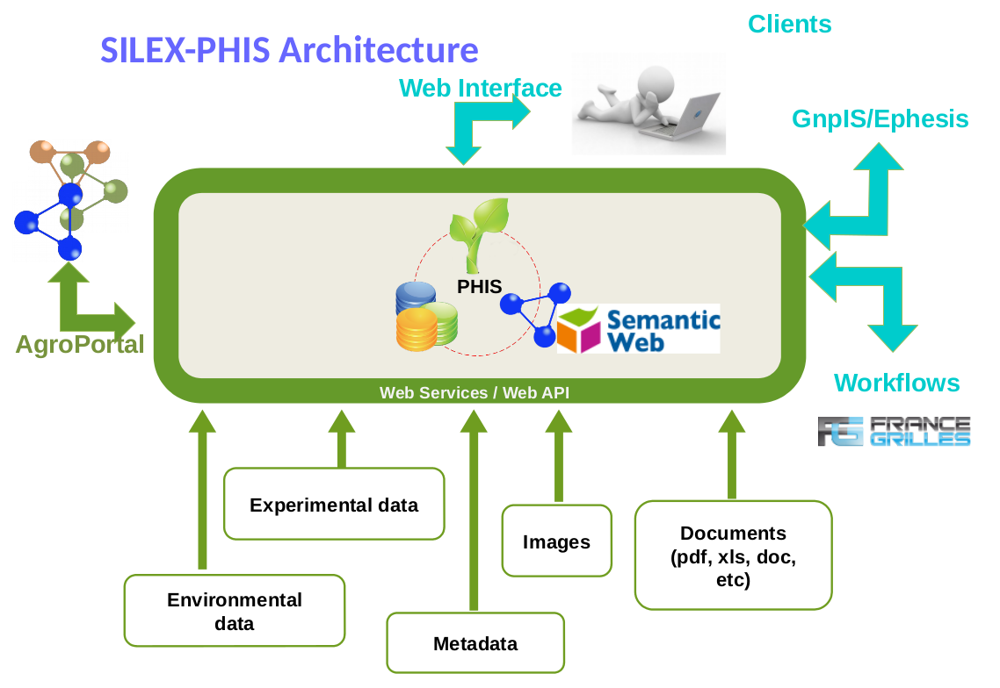
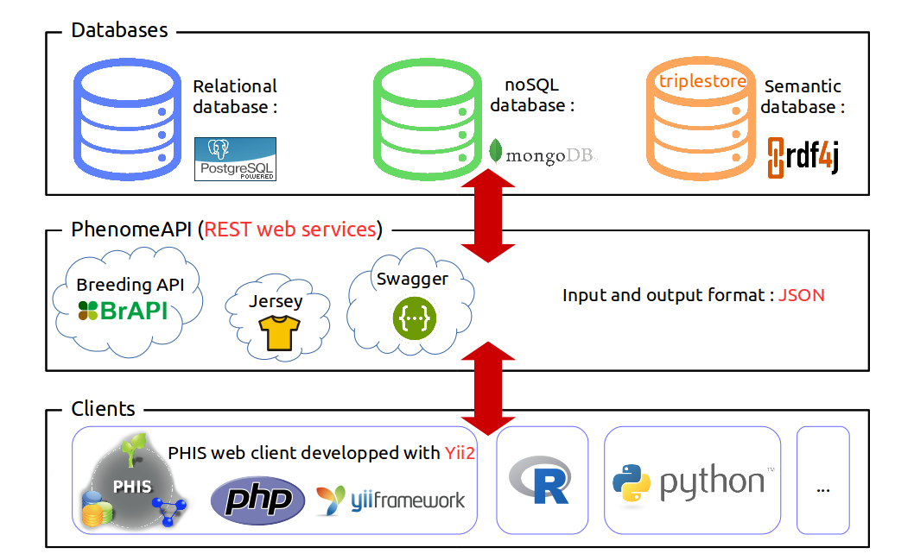

# PHIS users documentation

## Background
Phis (Phenotyping Hybrid Information System) is developped for high-throughput plant phenotyping in close interaction to plant phenotyping communities.
Phis is part of SILEX collaborative meta-project developped at MISTEA joint research unit (INRA - SupAgro).
More information on SILEX is availbale at [SILEX wiki](https://mulcyber.toulouse.inra.fr/plugins/mediawiki/wiki/silex/index.php/Accueil "SILEX wiki Main Page").
The present documentation is a resource material related to the Phis version developped for field phenotyping, which complete name is SILEX-PHIS-FIELD.

Phis is organized around three layers : the layer of the data storage (first layer), which the users do not access directly, but using clients (3rd layer) which interact with the data layer through the web services layer (2nd layer).

## Contributors
Contributors to this documentation are agents of the joint research unit MISTEA (INRA - SupAgro) in Montpellier :

- Pierre-Etienne Alary
- Morgane Vidal
- Anne Tireau

Every Phis user is welcomed to enrich this repository with her/his experience of the information system.

## Issues
This documentation is currently under developpement.
If a Phis user wish to point out a flaw in this documentation, he is welcomed to do so in this repository's [GitHub issues](https://github.com/OpenSILEX/phis2-docs-community/issues).
Concerning issues with Phis itself, users are invited to report them via another channel, which has not been set up to this day.

## Version
&copy; INRA MISTEA 2014-2018 (SILEX-PHIS v.2.2 - 18 January 2018)
